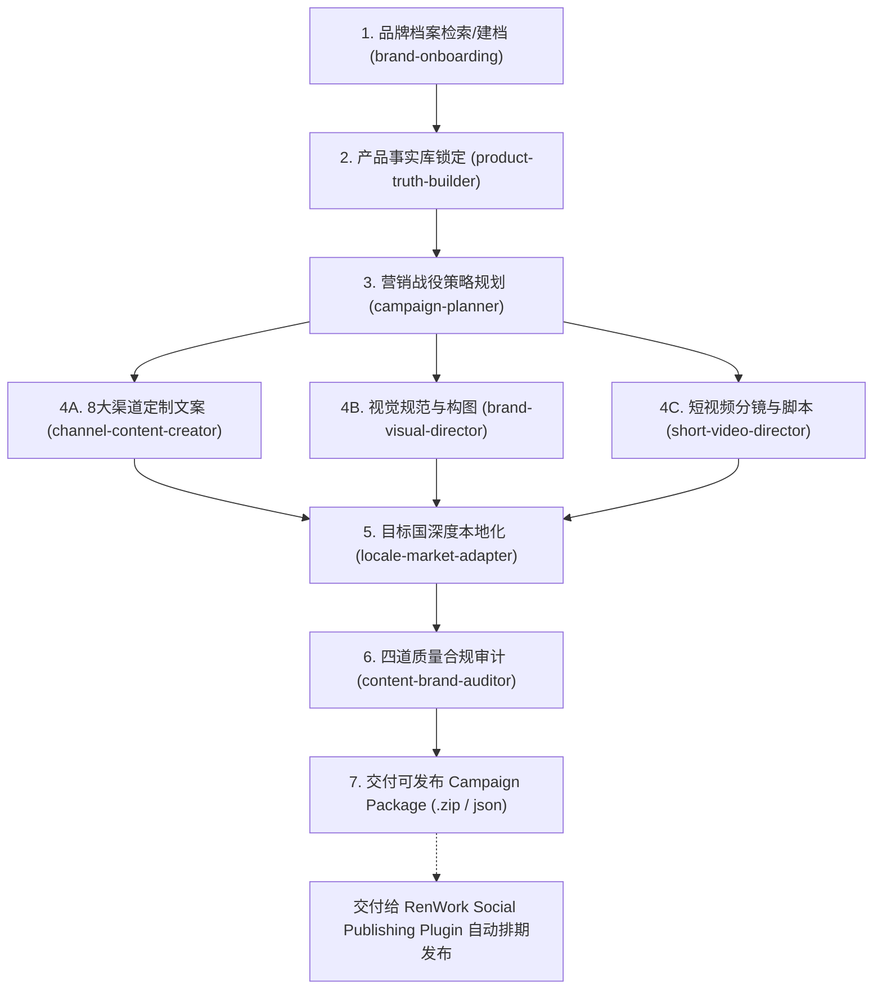

# RenWork 品牌系统底座与外贸内容生产总控引擎 (Brand & Content Orchestrator)

本技能是 **RenWork Brand & Content Plugin** 的中央调度中枢。它连接企业品牌底座与外贸多渠道内容工厂，驱动标准化的 6 步内容生产飞轮。



---

## 核心职责与执行准则

1. **事实先行（No Hallucination）**：所有宣传文案、卖点、参数和认证必须严格锚定 `ProductTruth`，严禁编造任何未验证的数据或案例。
2. **品牌统一（On-Brand Always）**：严格遵循 `BrandProfile` 中的主色调比例、字体排版阶梯、Logo安全区与语调红线。
3. **渠道定制（Native Channel Tone）**：严禁“一套文案发全网”，必须根据 LinkedIn（专业严谨B2B）、Facebook（社区互动与场景）、Instagram（视觉审美）、TikTok（3秒黄金Hook）等平台特性定制。
4. **合规锁死（4-Gate Audit）**：任何物料在交付前必须通过四道质量闸门（事实审计、品牌一致性、渠道规范、法律合规），得分 < 85 或存在 blocker 风险一律拦截并自动修复。
5. **清晰边界**：本插件负责内容策划、生成、视觉与合规物料包输出，最终的社交媒体登录、API排期与自动发送交付给独立的 `RenWork Social Publishing Plugin`。

---

## 调度执行指令

当用户提出内容生产需求时，按以下流程自动串联子技能：

```bash
# 1. 检查或新建企业品牌档案
invoke_skill brand-onboarding --company_id="<company_id>"

# 2. 读取并锁定产品事实参数
invoke_skill product-truth-builder --product_id="<product_id>"

# 3. 生成本月/本季度 Campaign 规划
invoke_skill campaign-planner --objective="b2b_lead_generation" --target_markets="US,DE,UAE"

# 4. 并行生成渠道物料
invoke_skill channel-content-creator --campaign_id="<campaign_id>"
invoke_skill brand-visual-director --campaign_id="<campaign_id>"
invoke_skill short-video-director --campaign_id="<campaign_id>"

# 5. 进行目标市场本地化适配
invoke_skill locale-market-adapter --languages="en,de,ar"

# 6. 四道质量闸门审计
invoke_skill content-brand-auditor --campaign_package_dir="outputs/campaigns/<campaign_id>"
```
