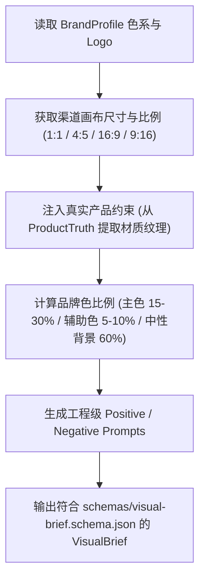

# 品牌视觉总监技能 (Brand Visual Director)

`brand-visual-director` 将 BrandVision 的设计美学底座与营销场景深度结合，确保 AI 生成的所有宣传配图、信息长图、社媒封面和广告物料在**品牌视觉一致性**与**外贸商用转化力**上达到出版级水准。

---

## 核心视觉控制准则



---

## 渠道视觉尺寸标准矩阵

| 渠道平台 | 推荐画布比例 | 推荐分辨率 | 视觉重点 |
| :--- | :--- | :--- | :--- |
| **LinkedIn Feed** | 1.91:1 / 1:1 | 1200x628 / 1200x1200 | 专业工业实景、数据信息图、清晰图表 |
| **Facebook Post** | 1:1 / 4:5 | 1080x1080 / 1080x1350 | 工程现场、产品细节、真实施工对比 |
| **Instagram Post** | 4:5 / 1:1 | 1080x1350 / 1080x1080 | 建筑美学、材质光影、现代极简调性 |
| **YouTube Thumbnail** | 16:9 | 1280x720 (1080P) | 高对比度主体、大字号痛点、醒目色块 |
| **TikTok / Reels** | 9:16 | 1080x1920 | 坚决避开顶部状态栏与底部文案遮挡安全区 |
| **官网博客 Hero** | 16:9 / 21:9 | 1920x1080 / 2560x1080 | 宽画幅沉浸式车间或工程全景 |

---

## 视觉一致性与负面提示词工程

每次生成视觉指令时，必须包含以下负向约束，防止 AI 产生虚假伪劣感：

```yaml
negative_prompt: >
  blurry, low resolution, plastic-looking, cartoon, 3d CGI artificial artifact,
  distorted perspective, wrong proportions, messy background, oversaturated neon colors,
  disfigured hands, mutated fingers, watermark, fake non-existent brand logos,
  unrealistic glossy finish on matte stone, fake certificates with gibberish text
```
