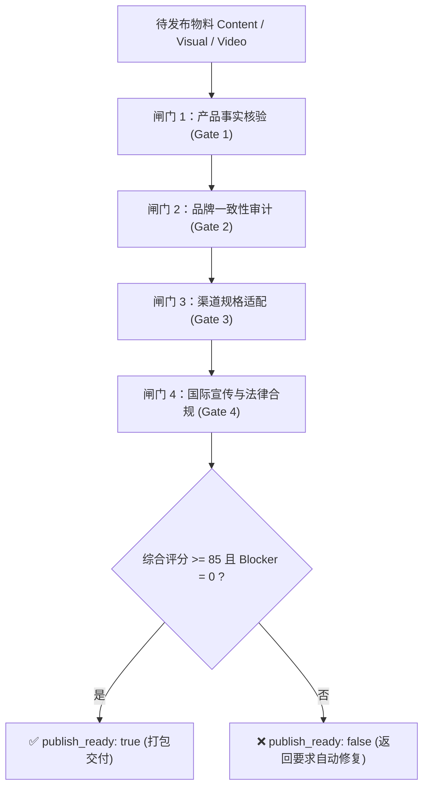

# 四道质量合规审计技能 (Content & Brand Auditor)

`content-brand-auditor` 是内容交付前的**终审裁决中心**。任何宣传文案、图文或视频在被打包为 Campaign Package 前，必须通过四道自动化质量闸门。



---

## 四道质量闸门审计规则

### 闸门 1：产品事实核验 (Product Fact Verification)
- **检查内容**：文案中提及的材料、尺寸、抗拉强度、吸水率、认证证书编号等，是否 100% 存在于 `product_truth.json` 的 `verified_claims` 中；
- **拦截规则**：发现任何未在事实库登记的夸大数据或虚构检测结果，直接标记 `severity: "blocker"`。

### 闸门 2：品牌一致性审计 (Brand Consistency Audit)
- **检查内容**：
  - 主视觉中品牌主色占比是否在 15-30% 范围内；
  - 字体是否使用指定品牌字体阶梯；
  - 语调是否违背 `voice_tone.prohibited_expressions`；
  - Logo 是否完整放置在安全区内（未被裁切或遮挡）。

### 闸门 3：渠道规格适配 (Channel Specifications Audit)
- **检查内容**：
  - 图片/视频比例是否严格符合渠道要求（如 Reels 9:16、Instagram 4:5）；
  - 短视频文字是否避开了 TikTok/Reels 底部文案与右侧按钮遮挡区；
  - 字数是否超出各平台最佳展示截断长度（如 LinkedIn 3000 字符内，首 2 行必须有吸睛 Hook）。

### 闸门 4：国际宣传与法律合规 (Legal & Advertising Compliance)
- **检查内容**：
  - 是否触犯欧美 FTC / 欧盟反不正当竞争广告法（严禁“100% 行业第一”、“全球最低价”等无依据绝对化用语）；
  - 是否包含必要的行业免责声明（Disclaimer）；
  - 是否侵犯第三方注册商标。

---

## 质量报告输出 (QA Report)

审计结果保存为 `reports/qa_report_<item_id>.json`，严格遵循 `schemas/qa-report.schema.json`。

```json
{
  "audit_id": "qa_stone_us_post_01",
  "item_ref": "item_stone_us_01",
  "timestamp": "2026-08-16T10:00:00Z",
  "scores": {
    "brand_score": 96.0,
    "content_score": 94.0,
    "visual_score": 92.5,
    "channel_score": 95.0,
    "overall_score": 94.4
  },
  "gates": {
    "gate_1_fact_verification": {
      "passed": true,
      "unsupported_claims": [],
      "verified_claims_count": 4
    },
    "gate_2_brand_consistency": {
      "passed": true,
      "tone_check": "on_brand",
      "color_accuracy": true
    },
    "gate_3_channel_specs": {
      "passed": true,
      "aspect_ratio_match": true,
      "safe_zone_respected": true,
      "character_count_ok": true
    },
    "gate_4_legal_compliance": {
      "passed": true,
      "restricted_words_detected": [],
      "disclaimer_present": true
    }
  },
  "claim_risk": "none",
  "publish_ready": true,
  "required_fixes": []
}
```
