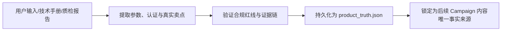

# 产品事实库构建技能 (Product Truth Builder)

`product-truth-builder` 是 RenWork 外贸内容生产的**事实安全防线**。外贸 B2B 采购极其看重合规、真实参数与认证资质。任何 AI 生成的内容，必须**先读产品事实库，再启动创意生成**。

---

## 产品事实库的核心结构

每个产品档案必须严格遵循 `schemas/product-truth.schema.json`：

1. **基本规格与材料 (Specifications & Materials)**：
   - 精确材质成分（如：Cordura 1000D 尼龙、食品级 316 不锈钢、天然花岗岩 G603、优质牛磺酸 99.5% 纯度等）；
   - 物理尺寸、承重、耐温、透气率、拉伸强度等量化参数；
2. **权威认证与报告 (Certifications & Audits)**：
   - CE, FDA, REACH, RoHS, OEKO-TEX, ISO9001, BSCI, GRS 等；
   - 证书编号、发证机构与有效期；
3. **商业交付参数 (Commercial Terms)**：
   - 真实最小起订量 (MOQ)；
   - 打样周期 (Sample Lead Time) 与量产交付周期 (Production Lead Time)；
   - OEM/ODM 深度定制能力（开模、丝印、包装、打标）；
4. **可宣传主张库 (Verified Claims)**：
   - 必须附带证据来源（如：SGS 测试报告编号、第三方质检证书、工厂实验室数据）；
5. **严禁宣传内容 (Prohibited Claims)**：
   - 严禁宣传企业未获得的认证（例如没有 FDA 认证严禁宣称通过 FDA）；
   - 严禁未经授权声称为某世界顶级品牌的“独家代工厂”；
   - 严禁出现未经实验室佐证的极端性能词（如“永不磨损”、“绝对零故障”）。

---

## 标准操作流程 (SOP)



### 范例 Product Truth JSON

```json
{
  "product_id": "prod_stone_ledger_01",
  "company_id": "fujian_tianya_stone",
  "product_name": "天然石英岩文化石贴面 (Quartzite Ledger Stone Panel)",
  "product_name_en": "Natural Quartzite Stacked Stone Cladding Panels",
  "model_number": "TY-QS-6015",
  "category": "Architectural Stone Veneer",
  "materials": ["100% Natural Quartzite", "High-strength Polymer Bonding Resin"],
  "specifications": {
    "dimensions_mm": "600x150x15-25mm",
    "weight_per_sqm_kg": 38.5,
    "water_absorption_rate": "0.18%",
    "compressive_strength_mpa": 142.5,
    "frost_resistance": "-40°C Passed (50 Freeze-Thaw Cycles)"
  },
  "certifications": [
    {
      "name": "CE Marking (EN 1469 / EN 12057)",
      "cert_number": "CE-EU-2025-ST-9982",
      "issuing_body": "TUV Rheinland"
    },
    {
      "name": "ASTM C615 / C97 Tested",
      "cert_number": "SGS-QZ-2025-0819",
      "issuing_body": "SGS North America"
    }
  ],
  "key_selling_points": [
    "100% 纯天然石材，零辐射环保等级",
    "通过 50 次极寒冻融测试（-40°C 严寒不开裂）",
    "Z 字型联锁无缝拼接设计，施工提速 40%",
    "自有矿山稳定供货，单月产能达 30,000 ㎡"
  ],
  "commercial_terms": {
    "moq": "1x20'GP Container (approx. 500-600 sqm)",
    "lead_time": "15-20 days after deposit",
    "sample_policy": "Free sample box (freight collect / refundable on bulk order)",
    "oem_odm_capability": "Custom corner pieces, custom wooden crate packaging with buyer's label"
  },
  "verified_claims": [
    {
      "claim": "Water absorption < 0.2% suitable for exterior freeze-thaw climates",
      "evidence_source": "SGS Test Report SGS-QZ-2025-0819"
    }
  ],
  "prohibited_claims": [
    "Never claim synthetic PU stone claims (our products are 100% genuine quarried stone)",
    "Do not claim 7-day sea freight delivery (production is 15-20 days + ocean shipping)"
  ]
}
```
