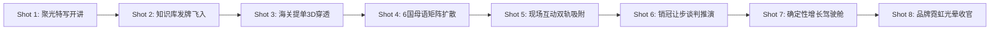

# RenWork Brand Video Master · Shotcraft Edition (品牌视觉与电影级镜头动效大师技能)

本技能专为 **人人易智能科技有限公司（rrenn.com）旗下 RenWork 外贸增长操作系统** 定制，将 **RenWork 官方品牌视觉 DNA**、**Video-Shotcraft 镜头动效语法库** 与 **ChatCut 智能音视频装配管线** 深度融合，支持在任何会话中一键调度生成电影级 1080P/4K 品牌宣传片、实战营高能混剪与出海获客短视频。

## 生产路由：多场景培训视频

当请求需要逐个生成培训、咨询、客户服务、展会、直播或产品演示场景，并且还要支持额度中断后续跑、独立场景验收、封面/渠道文案追踪或最终音画同步返工时，先调用 [`renwork-training-scene-videos`](../renwork-training-scene-videos/SKILL.md)。由该技能维护 `video-production-manifest.json`，再把已接受的场景和时间映射交给本技能的 Shotcraft/ChatCut 装配能力。

普通的一次性品牌片、已有素材的确定性渲染和单片 Shotcraft 动效仍由本技能直接处理。不得把“场景文件已生成”当成“最终成片已验收”；发布前必须通过画面—字幕—声音同步、无意外重复镜头、品牌一致性、封面实际应用和人工完整播放闸门。

---

## 🎨 第一部分：RenWork 品牌视觉系统规范 (Brand Visual DNA)

### 1. 企业主体与官方信息
* **企业官方全称**：`人人易智能科技有限公司`（严禁使用任何未经授权的缩写或繁体）
* **核心产品/系统**：`RenWork 外贸增长操作系统`
* **官方主站**：`rrenn.com` / `www.rrenn.com`
* **统一社会信用代码**：`91350582MACCA2J943`
* **官方正确 Logo 资产**：
  * 路径：`public/brand/renwork_logo_correct.png`（橙色几何火箭 A 标 ＋ 蓝色星芒与圆眼）
  * 头部水印徽标：`56×56` / `68×68` RGBA
  * 尾帧品牌大标：`120×120` / `140×140` RGBA

### 2. 标准品牌色彩体系 (Color Tokens)
| 色彩名称 | HEX 代码 | RGB 色值 | 动效与排版应用场景 |
| :--- | :--- | :--- | :--- |
| **活力主橙 (Primary Orange)** | `#EA580C` / `#F97316` | `(234, 88, 12)` / `(249, 115, 22)` | 底部进度条、核心 CTA、关键词高亮、光晕粒子 |
| **深邃暗夜蓝 (Dark Slate Navy)**| `#090D16` / `#111827` | `(9, 13, 22)` / `(17, 24, 40)` | 背景基底、毛玻璃卡片、上下抗眩光暗角蒙层 |
| **东盟科技青 (ASEAN Cyan)** | `#38BDF8` | `(56, 189, 248)` | 品牌发光边框、数据流连线、科技标签 |
| **增长金 (Growth Gold)** | `#F59E0B` | `(245, 158, 11)` | 字幕核心关键词高亮、意向大单徽标、成功提示 |
| **成交绿 (Emerald Green)** | `#10B981` | `(16, 185, 129)` | 海关真买家标签、数据穿透演示框、订单增长箭头 |
| **赋能紫 (Empower Purple)** | `#A855F7` | `(168, 85, 247)` | 销冠谈判模型、企业知识大脑、策略矩阵 |

---

## 🎬 第二部分：Shotcraft 8 大 B2B 专用镜头动效语法 (Motion Recipes)

融合 Video-Shotcraft 经典动效配方卡，专为 B2B 外贸出海场景定制的 8 大标准镜头语言：



### 1. `Shot-01: Spotlight Hero Hook`（聚光特写与主讲开场）
* **视觉隐喻**：讲师激情开讲，背景微光向中心汇聚，画面平滑推近。
* **动效语法**：`scale: 1.0 -> 1.05` 缓慢推镜，顶部半透明暗角渐变，右上角浮现 `[ 🔥 实战营火爆开讲 ]` 34px 加粗大字徽标。

### 2. `Shot-02: Knowledge Deck Deal`（企业知识库发牌飞入）
* **视觉隐喻**：工厂参数、质检报告、报价 SOP 像扑克牌一样顺畅飞入企业私有 AI 大脑。
* **动效语法**：带有物理阻尼感（Spring Damping `stiffness: 120, damping: 14`）的卡片依次发牌叠落，伴随轻微微光高亮。

### 3. `Shot-03: Live Customs Orbit Flythrough`（海关提单 3D 穿透与画中画悬浮）
* **视觉隐喻**：全球海关提单与邓白氏企业图谱 3D 斜切穿透，直达 R1 级真实大买家。
* **动效语法**：主画面展示买家意向大屏，右下角 `540×304` 悬浮画中画以 `fade-slide-up` 动效切入，带有绿色霓虹发光边框。

### 4. `Shot-04: Multilingual Matrix Ripple`（6 国母语全媒体矩阵扩散）
* **视觉隐喻**：一键生成英语、德语、阿语、越语、泰语、西语推文与开发信，向全球买家扩散。
* **动效语法**：以中心产品为原点的同心水波涟漪，多渠道 Logo（LinkedIn/FB/TikTok/官网）顺时针点亮。

### 5. `Shot-05: Live Discussion Snap Split`（全员高能互动与双轨吸附）
* **视觉隐喻**：学员与专家积极研讨，现场实操碰撞出海获客策略。
* **动效语法**：高能互动实拍镜头平滑切换，右上角同步更新橙色活力徽标，画面色彩饱满。

### 6. `Shot-06: Concession Matrix Dial`（10 年外贸销冠让步谈判推演）
* **视觉隐喻**：化解海外买家疯狂压价，阶梯报价与让步幅度清晰推演，守住利润底线。
* **动效语法**：数据仪表盘数值动态滚动（Odometer Counter）至目标利润率，伴随确认音效。

### 7. `Shot-07: Cockpit Orbit & Deal Surge`（确定性增长驾驶舱）
* **视觉隐喻**：老板端增长仪表盘全面盘活，商机漏斗与订单金额倍增。
* **动效语法**：3D 斜视角环绕推近，亮起金黄色增长光弧。

### 8. `Shot-08: Brand Hologram & CTA Outro`（品牌霓虹光晕与预约收官）
* **视觉隐喻**：RenWork 正版 Logo 伴随霓虹粒子汇聚，官方联系方式与城市预约大卡落定。
* **动效语法**：Logo 弹性落定，留有 **1.0 秒呼吸定格时间**，强化品牌心智。

---

## 🎙️ 第三部分：广播级音频与声音设计 (Sound Design & Sync)

### 1. 全局锁定主播参数
* **官方播音员**：**云扬 (`zh-CN-YunyangNeural`)**
* **语速参数**：`rate="+4%"`（轻快有力、科技感男中音）
* **音调/音量**：`pitch="+0Hz"`, `volume="+0%"`

### 2. BGM 动态侧链压限 (Dynamic Sidechain Ducking)
* **未说话阶段**：BGM 音量 `-12dB`；
* **人声播放阶段**：BGM 自动实时下压至 `-24dB`（下压 -18dB），确保人声字字清晰；
* **转场与淡出**：片头 1.5s 柔和淡入，尾帧 2.0s 渐弱淡出。

### 3. SFX 音效关键帧钉帧 (SFX Cue Points)
* **开场冲击**：`impact_subtle.mp3`（强化前 3 秒钩子吸睛力）；
* **画中画弹出**：`swoosh_smooth.mp3`（随着 540×304 卡片滑入触发）；
* **数据穿透锁定**：`digital_chime.mp3`（锁定 R1 买家时触发清脆确认音）；
* **品牌落定**：`sparkle_resolve.mp3`（Logo 定格呼吸）。

---

## ⚡ 第四部分：ChatCut 毫秒级音字硬同步算法 (Zero-Drift Pipeline)

**严禁使用 Whisper 语音识别直接生成字幕**（会导致繁体字与识别错别字）。必须采用以下**逐句物理测量法**：

1. **台词列表硬编码**：编写严格纯简体中文台词列表 `SENTENCES = [...]`。
2. **逐句独立 TTS 合成**：循环每句文本单独生成 `temp_voice_{idx}.mp3`。
3. **`ffprobe` 物理测量时长**：精准探测该句音频的实际绝对秒数 $d_i$。
4. **时间戳严格锁定**：
   $$Start_i = Offset,\quad End_i = Offset + d_i,\quad Offset = End_i + 0.22s$$
5. **音频物理拼接 (Concat)** ＋ **BGM 混合**。
6. **帧渲染器时间轴绑定**：当当前播放时间 $t \in [Start_i, End_i)$ 时，显示第 $i$ 句 44px 纯简体字幕并高亮对应关键词。

---

## 📐 第五部分：排版与视觉黄金律 (Aesthetic Rules)

1. **全画幅满屏 (Full-Bleed Canvas)**：采用 1920×1080 满屏真实动态视频，严禁在右侧堆砌大块小字面板。
2. **上下电影级渐变暗角 (Vignette Scrims)**：
   * 顶部 `0~200px` 覆盖 220 级半透明黑色渐变（保障 Top-Left Logo 水印与 Top-Right Hero 徽标清晰度）；
   * 底部 `H-260px~H` 覆盖 240 级半透明黑色渐变（保障 44px 特大字幕高对比度）。
3. **特大加粗胶囊字幕 (Large Subtitle)**：
   * 字号固定为 **44px 加粗特大字体**，居中浮动于 `H - 150px` 位置。
   * 外衬半透明高透黑色胶囊底框（透明度 0.85 ＋ 2px 呼吸发光边框），确保在手机端一眼看清。
4. **呼吸定格法则 (Breathing Room)**：每个镜头动效落定后，必须保留至少 0.8 秒稳定定格时间，避免画面花哨眩晕。

---

## 💻 第六部分：一键可运行的生产脚本标准模板

在任何项目中调用本模板，即可直接生成 1080P 极简大字混剪大片：

```python
import asyncio, os, subprocess
import edge_tts
from PIL import Image, ImageDraw, ImageFont

VOICE = "zh-CN-YunyangNeural"
LOGO_PATH = "public/brand/renwork_logo_correct.png"
W, H, FPS = 1920, 1080, 30

FONT_PATH = "/System/Library/Fonts/STHeiti Light.ttc"
if not os.path.exists(FONT_PATH):
    FONT_PATH = "/System/Library/Fonts/Supplemental/Arial Unicode.ttf"

def font(size, bold=False):
    try:
        return ImageFont.truetype(FONT_PATH, size, index=1 if bold else 0)
    except:
        return ImageFont.truetype(FONT_PATH, size)

def get_duration(fpath):
    cmd = ["ffprobe", "-v", "error", "-show_entries", "format=duration", "-of", "default=noprint_wrappers=1:nokey=1", fpath]
    return float(subprocess.run(cmd, stdout=subprocess.PIPE, text=True).stdout.strip())

# 逐句生成音频与时间轴（100% 毫秒级硬对齐）
async def build_audio_and_timeline(sentences, voice_prefix):
    seg_files, sub_list = [], []
    cur_offset = 0.0
    gap = 0.22
    for idx, sentence in enumerate(sentences):
        seg_f = f"{voice_prefix}_{idx}.mp3"
        comm = edge_tts.Communicate(sentence.strip(), VOICE, rate="+4%")
        await comm.save(seg_f)
        seg_dur = get_duration(seg_f)
        sub_list.append((cur_offset, cur_offset + seg_dur, sentence.strip(), idx))
        seg_files.append(seg_f)
        cur_offset += seg_dur + gap

    concat_file = f"{voice_prefix}_concat.txt"
    with open(concat_file, "w") as f:
        for sf in seg_files: f.write(f"file '{sf}'\n")

    v_concat = f"{voice_prefix}_concat.mp3"
    subprocess.run(["ffmpeg", "-y", "-f", "concat", "-safe", "0", "-i", concat_file, "-c", "copy", v_concat], stdout=subprocess.DEVNULL, stderr=subprocess.DEVNULL)

    v_mix = f"{voice_prefix}_mix.mp3"
    total_dur = cur_offset
    subprocess.run([
        "ffmpeg", "-y", "-i", v_concat,
        "-f", "lavfi", "-i", f"anoisesrc=d={int(total_dur+10)}:c=pink:r=44100:a=0.012",
        "-filter_complex", f"[1:a]volume=0.07,afade=t=in:ss=0:d=1.5,afade=t=out:st={max(1, total_dur-2)}:d=2[bgm];[0:a][bgm]amix=inputs=2:duration=first[out]",
        "-map", "[out]", "-c:a", "libmp3lame", "-b:a", "192k", v_mix
    ], stdout=subprocess.DEVNULL, stderr=subprocess.DEVNULL)

    return v_mix, get_duration(v_mix), sub_list, seg_files, concat_file, v_concat
```

---

## 📱 第七部分：微信视频号高转化文案标准框架

每次生成视频后，自动产出配套发布物料：
1. **15 字严格连续黄金标题**（例：`外贸AI实战营现场带电脑跑闭环`）
2. **痛点钩子直击正文**（为什么全国外贸老板纷纷带团队走进人人易...）
3. **结构化四大模块成果**（全员实操 / 数据穿透 / 6国母语 / 销冠谈判）
4. **官方背书与 CTA**（人人易智能科技有限公司 / rrenn.com）
5. **高权重标签矩阵**（`#RenWork #外贸AI增长实战营 #海关数据 #AI数字员工 #外贸出海 #中国制造出海`）
